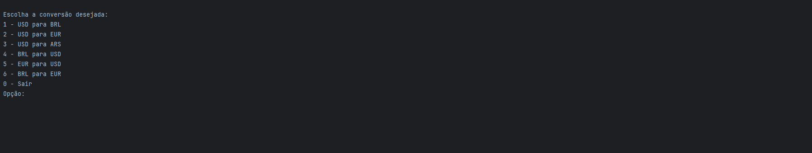

# ConversorDeMoedas

Projeto em Desenvolvimento referente ao curso, Formação Java e Orientação a Objeto Alura/Oracle

## 📌 Descrição

Este projeto é um conversor de moedas em Java que utiliza a API ExchangeRate para obter taxas de câmbio em tempo real.
O objetivo é aplicar conhecimentos de orientação a objetos, consumo de API com `HttpClient` e manipulação de JSON usando `Gson`.

## 🖼️ Demonstração



## 🛠️ Tecnologias utilizadas

- Java 17+
- API ExchangeRate
- Gson (para leitura de JSON)
- IDE IntelliJ ou VSCode

## 📚 Funcionalidades

- Menu interativo com 6 tipos de conversões de moeda
- Consumo da API de taxas de câmbio
- Entrada personalizada do valor a ser convertido
- Exibição do resultado formatado

## 🚀 Como executar

```bash
# Clonar o repositório
git clone https://github.com/viniciuspimentelsilva/ConversorDeMoedas.git

# Navegar até o diretório
cd ConversorDeMoedas

# Abrir na sua IDE favorita e executar o método main da classe Principal
